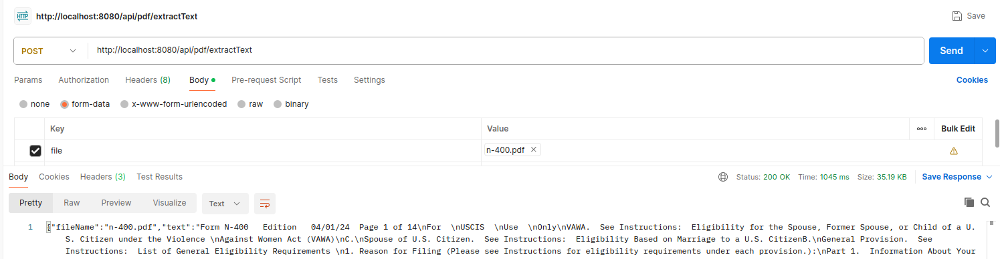

# simple-ocr-microservice
Simple OCR microservice with Tesseract, PDFBox and Docker

## Up and Running
```
mvnw install
docker compose up
```

## Try it out
Use Postman (or your favorite tool of choice) to upload a file to
`http://localhost:8080/api/pdf/extractText`. Select form-data and upload a file with the key 'file'. 
#### Like so: 



